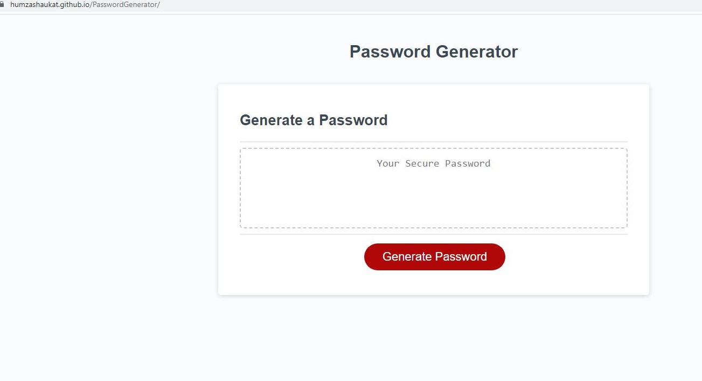

# PasswordGenerator

## Description

This is a password generator that functions to generate a psuedorandom password given requirements that the user is prompted for.  The password is displayed in the textbox and can be copied and pasted wherever it is needed.

## Usage

When the "Generate Password" button is pressed, a series of prompts will appear asking you questions about requirements for your password.  Once you choose a password length between 8 and 128 characters, the prompts will ask you if you would like to include lowercase letters, uppercase letters, numeric values, and special characters.  To select the criteria you would like to include reply "Y" or "N".  Once the criteria is filled out, you will be given a randomly generated password fulfilling that criteria.

## Mock-Up

Here is a screenshot  of the deployed application.

## Credits

Starter code was found [here](https://github.com/RutgersCodingBootcamp/RUT-VIRT-FSF-PT-10-2022-U-LOLC/tree/main/03-JavaScript/02-Challenge) at the Rutgers Coding Bootcamp Github Repository.

## License

MIT License